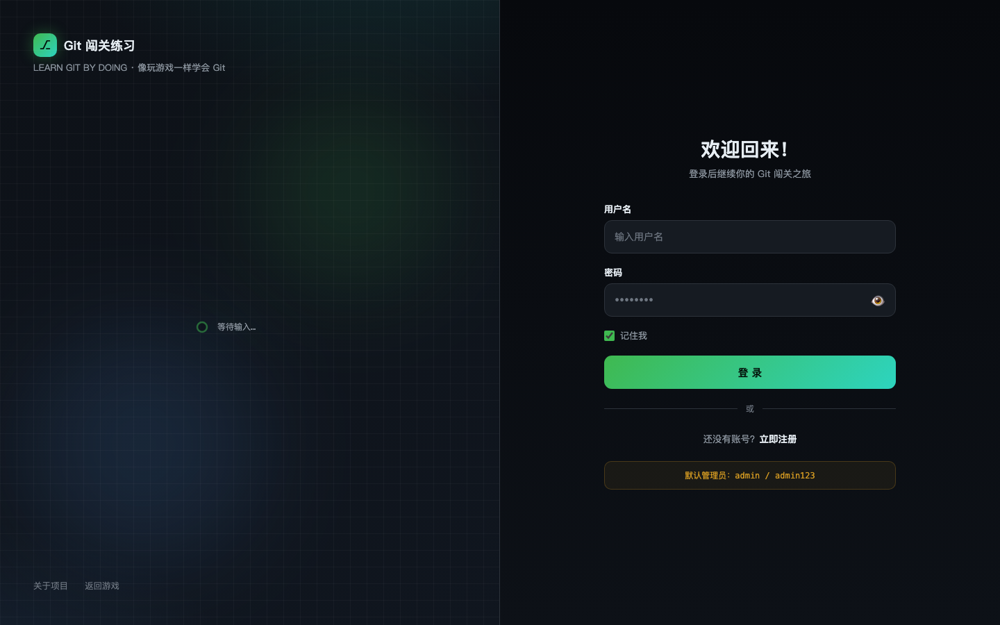
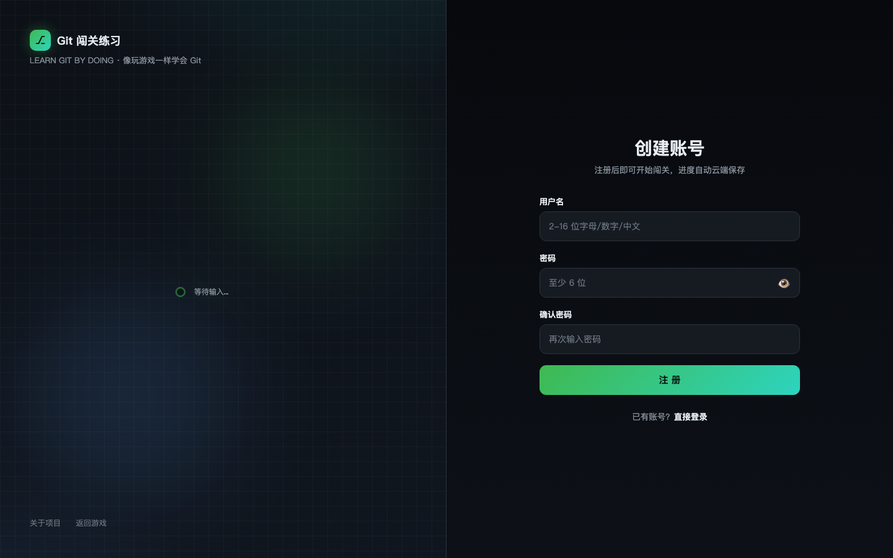
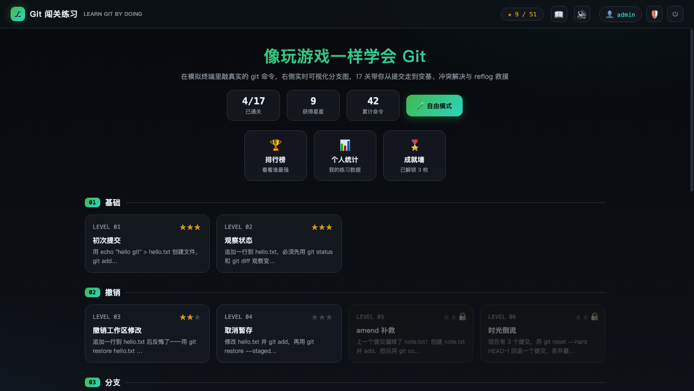
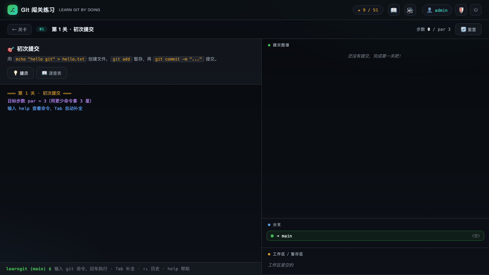
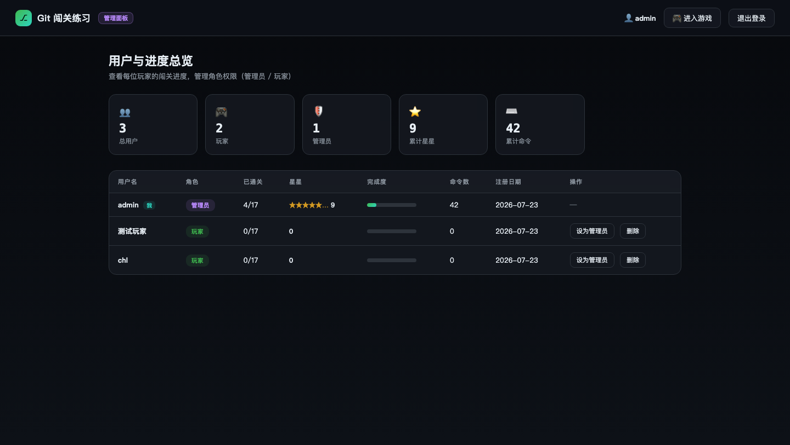

# 🎮 Git 闯关练习

在浏览器里通过**模拟终端**学习 git——敲真实的 git 命令完成 17 个关卡，右侧实时可视化分支图谱，从第一次提交一路练到变基、冲突解决与 reflog 救援。

内置**用户登录 + 角色权限**系统：玩家进度云端保存，管理员可在后台查看所有人的闯关情况并管理角色。配套**排行榜、成就徽章、个人统计面板**，并支持 **GitHub 账号登录**。

**线上体验：https://learngit-jet.vercel.app**

---

## 账号说明

| 账号 | 密码 | 角色 | 说明 |
|------|------|------|------|
| `admin` | `admin123` | 管理员 | 首次启动自动创建，拥有全部权限 |

- 普通玩家通过**注册页**自行创建账号（用户名 2–16 位字母/数字/中文/下划线，密码至少 6 位）
- 注册后即获得 `player` 角色，进度自动绑定账号云端保存
- 管理员可在管理面板中将玩家提升为管理员、降级或删除用户

> ⚠️ 线上环境建议尽快修改默认密码或创建新管理员后删除默认账号。

---

## 界面预览

### 登录页

左右分屏设计，左侧实时渲染 git 提交链动画，右侧为登录表单。底部提示默认管理员账号。



### 注册页

同样的分屏布局，注册后即可开始闯关，进度自动云端保存。



### 游戏主页（关卡选择）

登录后进入关卡选择界面，展示 17 个关卡按阶段分组（基础 → 撤销 → 分支 → 冲突 → 暂存与标签 → 高级），顶部显示星星进度、排行榜入口、个人统计和成就墙。



### 闯关终端

进入关卡后，左侧显示任务目标与提示，右侧实时渲染 SVG 提交图谱、分支列表和工作区状态，底部为模拟终端——支持 Tab 补全、↑↓ 历史、`help` 速查。



### 管理面板（仅管理员）

管理员可查看全部用户的通关数、星星、命令数，进行角色管理和用户删除操作。



---

## 快速开始

```bash
cd game
node server.js        # 零依赖，启动后自动打开浏览器 http://localhost:5188
```

或：

```bash
npm start             # 等价于 node server.js
```

> 因为使用了 ES Modules + 后端接口，请通过本地服务器访问，不要直接双击 `index.html`。
> 端口默认为 `5188`（避开 Vite 常用的 5173），可用 `PORT=xxxx node server.js` 覆盖。

启动后使用 **admin / admin123** 登录，或注册新账号开始闯关。

## 登录与角色

| 角色 | 权限 |
|------|------|
| **玩家 player** | 注册即得。正常闯关、自由模式，进度与星星绑定账号云端保存 |
| **管理员 admin** | 玩家的全部功能 + 顶栏 🛡️ 进入**管理面板**：查看每位用户的通关数/星星/命令数、提升/降级角色、删除用户 |

- 未登录访问游戏页会自动跳转到登录页
- 登录页 / 注册页采用左右分屏设计，左侧提交链会随你的密码输入实时变化
- 非管理员访问 `admin.html` 会被重定向回游戏

### GitHub 登录（可选）

在 [GitHub Developer Settings](https://github.com/settings/developers) 创建一个 **OAuth App**：

- **Homepage URL**: `http://localhost:5188`（线上填 `https://learngit-jet.vercel.app`）
- **Authorization callback URL**: `http://localhost:5188/github-callback.html`（线上填 `https://learngit-jet.vercel.app/github-callback.html`）

然后带上凭据启动服务器：

```bash
GITHUB_CLIENT_ID=xxx GITHUB_CLIENT_SECRET=yyy node server.js
```

登录页即会出现「使用 GitHub 登录」按钮。首次 GitHub 登录会自动创建对应玩家账号。

## 玩法

- **17 个关卡**，按 6 个阶段递进：基础 → 撤销 → 分支 → 冲突 → 暂存与标签 → **高级**（revert / reflog 找回丢失提交 / soft-reset 压缩提交）
- **par 星级系统**：用更少的命令拿 3 星
- **自由模式**：首页点「🧪 自由模式」，没有目标，随便折腾
- 右侧面板实时渲染 **SVG 提交图谱**、分支列表、工作区/暂存区状态
- 命令支持 **Tab 自动补全**、`↑↓` 历史、`help` 速查、`?` 打开命令速查表

## 数据与社交

- **🏆 排行榜**：按星星总数排名（星同则命令少者在前），首页一键查看，高亮自己的名次
- **🎖️ 成就墙**：15 枚徽章，从「初出茅庐」到「完美主义者」，过关后自动检测并弹出解锁提示
- **📊 个人统计**：通关进度环、各阶段星级分布、常用命令 Top 8
- 进度（星级 / 命令数 / 命令频次 / 成就）随账号云端保存，换设备无缝继续

## 项目结构

```
game/
├── index.html          # 游戏页（需登录）
├── login.html          # 登录页（分屏式 + GitHub 登录）
├── signup.html         # 注册页（分屏式）
├── admin.html          # 管理面板（仅 admin）
├── github-callback.html# GitHub OAuth 回调页
├── server.js           # 零依赖服务器：静态文件 + /api/* 接口
├── server/
│   ├── db.js           # 用户/会话持久化 + scrypt 密码哈希
│   ├── api.js          # 认证/进度/排行榜/管理 REST 接口
│   ├── github.js       # GitHub OAuth（code 交换 + 代理感知 HTTPS）
│   ├── kv.js           # 存储分发器（Redis / GitHub 仓库 / 本地文件）
│   ├── redis.js        # Upstash Redis 客户端
│   └── github-store.js # GitHub 仓库存储（Contents API）
├── api/
│   └── index.js        # Vercel Function 入口
├── vercel.json         # Vercel 路由配置（/api/* rewrite）
├── package.json
├── data/               # 运行时数据（users.json/sessions.json，已 gitignore）
├── docs/
│   └── screenshots/    # README 截图
├── css/
│   ├── style.css       # 游戏样式
│   └── auth.css        # 登录/注册/管理面板样式
├── js/
│   ├── main.js         # 游戏入口：认证守卫、初始化、屏幕路由
│   ├── auth.js         # 认证客户端 + 路由守卫
│   ├── authpage.js     # 登录/注册页逻辑 + 交互式提交链 + GitHub 登录
│   ├── github-callback.js # OAuth 回调：code 换会话
│   ├── admin.js        # 管理面板逻辑
│   ├── engine.js       # 迷你 git 引擎（对象/分支/HEAD/reflog 模型）
│   ├── state.js        # 共享状态（引擎实例 + 应用状态 + 当前用户）
│   ├── commands.js     # 命令解析与实现（add/commit/merge/rebase/revert/reflog...）
│   ├── levels.js       # 17 个关卡定义（setup/check/提示）
│   ├── achievements.js # 成就徽章定义与解锁检测
│   ├── panels.js       # 排行榜 / 个人统计 / 成就墙面板
│   ├── graph.js        # SVG 提交图谱（泳道算法）
│   ├── render.js       # 分支/文件面板渲染
│   ├── terminal.js     # 终端输出
│   ├── ui.js           # 屏幕、关卡流程、弹窗、速查表
│   ├── input.js        # 命令输入、自动补全、历史
│   ├── effects.js      # 音效 + 彩带
│   └── store.js        # 进度持久化（后端为主，localStorage 兜底）
└── test/
    ├── levels.test.js  # 关卡可通关性测试
    └── auth.test.js    # 认证/权限 API 端到端测试
```

## API 一览

| 方法 | 路径 | 权限 | 说明 |
|------|------|------|------|
| POST | `/api/auth/signup` | 公开 | 注册（默认 player） |
| POST | `/api/auth/login` | 公开 | 登录，返回 token |
| POST | `/api/auth/logout` | 登录 | 登出 |
| GET | `/api/auth/me` | 登录 | 当前用户 + 进度 |
| GET | `/api/auth/github/config` | 公开 | GitHub 登录是否启用 + client_id |
| POST | `/api/auth/github` | 公开 | 用 OAuth code 换取会话 |
| POST | `/api/progress` | 登录 | 保存进度（星级/命令数/频次/成就） |
| GET | `/api/leaderboard` | 登录 | 排行榜 Top 10 + 我的名次 |
| GET | `/api/admin/users` | admin | 用户列表 + 进度 |
| POST | `/api/admin/users/:id/role` | admin | 修改角色 |
| DELETE | `/api/admin/users/:id` | admin | 删除用户 |

## 测试

```bash
npm test              # 关卡可通关性 + 认证/权限 API 全部测试
npm run test:levels   # 只跑关卡
npm run test:auth     # 只跑认证 API（自动用隔离的临时数据目录）
```

## 云端部署（Vercel）

项目已部署至 **https://learngit-jet.vercel.app**，采用**双存储模式**，同一份代码本地与云端通用：

| 环境 | 存储 | 说明 |
|------|------|------|
| 本地 `node server.js` | `data/*.json` 文件 | 零依赖，改动即写盘 |
| Vercel Functions | Upstash Redis / GitHub 仓库 | 检测到对应环境变量自动启用 |

- `api/index.js` + `vercel.json`：rewrites 把 `/api/*` 全部汇聚到入口函数，每个请求 `hydrate() → 处理 → persist()`
- `server/kv.js`：存储分发器，优先 Redis，其次 GitHub 仓库存储，最后本地文件
- 部署时 Vercel 项目 **Root Directory 设为 `game/`**，自动识别 `api/` 目录
- **GitHub ↔ Vercel 自动同步**：每次 `git push` 到 KD-CHL/learngit 自动触发部署，约 10 秒上线

### 部署步骤（从零开始）

1. 在 [Vercel](https://vercel.com) 新建项目 → 导入 `KD-CHL/learngit` → Root Directory 填 `game`
2. 添加环境变量（任选其一或同时配置）：
   - **Upstash Redis**（推荐）：`UPSTASH_REDIS_REST_URL`、`UPSTASH_REDIS_REST_TOKEN`
   - **GitHub 仓库存储**（兜底）：`GITHUB_DATA_TOKEN`（需对数据仓库有 Contents 读写权限）
3. 线上 GitHub 登录还需：`GITHUB_CLIENT_ID`、`GITHUB_CLIENT_SECRET`
4. 部署后每次 `git push` 自动同步上线

## 支持的 git 命令

`status` `add` `commit (--amend --no-edit)` `log` `diff` `branch` `switch/checkout` `merge (--abort)` `rebase` `cherry-pick` `reset (--hard/--soft)` `revert` `reflog` `restore (--staged)` `stash` `tag` `show`，以及 `echo > / >>`、`ls`、`cat`、`rm`、`clear`。
